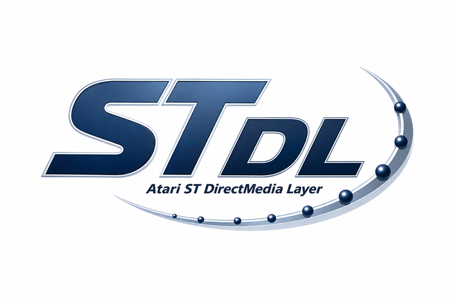

<p align="center">
  
</p>

# STDL - Atari ST DirectMedia Layer

An easier way to port SDL 1.x games to the Atari ST, by [Neil Rackett](https://neilrackett.com/atarist).

## Introduction

STDL is a planar-native subset of SDL 1.2 that makes SDL 1.x game ports to the
Atari ST / STE / Mega STE mostly mechanical.

To avoid all of the performance issues associated with SDL on Atari ST, there
is no chunky backbuffer and no c2p anywhere in the pipeline: ST interleaved
planar is the native format, assets are converted offline, and spans, rects and
blits are the primary verbs.

Anything that cannot be done cheaply in planar has been removed rather than
emulated; see [docs/limits.md](docs/limits.md).

## Layout

| Path              | Contents                                                                             |
| ----------------- | ------------------------------------------------------------------------------------ |
| `include/stdl/`   | public headers, one per module                                                       |
| `include/compat/` | SDL.h and SDL_mixer.h - the SDL 1.2 compatibility shims                              |
| `src/`            | video, surface, draw, blit, blitter, palette, event, cursor, time, dirty, sprite,    |
|                   | asset, bmp, degas, audio, music, sfx, ym, compat, mixer                              |
| `tools/stdlconv/` | asset converter: image quantise + planar, sprite/tile/font banks, Degas PI1,         |
|                   | WAV (incl. MS ADPCM) to STE DMA rates, MIDI to YM music, C-array embedding           |
| `examples/`       | ported SDL 1.2 test programs + original STDL demos and their assets (public domain)  |
| `docs/`           | format.md (the contract), porting.md, limits.md, design-overview.md                  |
| `.claude/skills/` | the `stdl` porting skill (auto-discovered by Claude Code in this repo)               |
| `dist/`           | build output: .TOS binaries + copied assets (untracked; doubles as a GEMDOS drive)   |

## Building

The easiest way is to cross-compile with `m68k-atari-mint-gcc` using
[atarist-toolkit-docker](https://github.com/sidecartridge/atarist-toolkit-docker):

```
stcmd make
```

This produces `libstdl.a` in the project root and all of the example programs
in `dist/`, which doubles as a Hatari GEMDOS drive for testing:

```
hatari --machine megaste dist/TSPRITE.TOS
```

## Status

v1.0: 320x200, 4 planes, 16 colours. The library and the SDL 1.2
test-suite ports below all run under EmuTOS/TOS on Hatari:

| Example      | Exercises                                                                        |
| ------------ | -------------------------------------------------------------------------------- |
| TBITMAP.TOS  | 1bpp expansion, band fills, mouse events                                         |
| GRAYWIN.TOS  | fills, clipping, palette                                                         |
| TESTWIN.TOS  | BMP loading, surface blits, palette fades                                        |
| TSPRITE.TOS  | colour-keyed sprite blits, dirty rects, FPS                                      |
| TPALETTE.TOS | palette animation on a 16-entry budget                                           |
| CHECKKEY.TOS | raw IKBD keyboard: key-ups, modifiers, unicode                                   |
| TTIMER.TOS   | 200Hz timing, cooperative timers                                                 |
| TBLITSPD.TOS | blit throughput baseline                                                         |
| TVIDINFO.TOS | capability report + fill/blit/flip benchmarks                                    |
| TKEYS.TOS    | keysym name table dump                                                           |
| TJOY.TOS     | joystick port 1 as SDL joystick 0                                                |
| LOOPWAVE.TOS | STE/Mega STE DMA sample playback (STDL_Audio)                                    |
| TCURSOR.TOS  | software mouse cursor with save-under                                            |
| PLAYMUS.TOS  | YM music (stdlconv midi -> STDL_Music) + DMA chunks via the SDL_mixer shim       |
| SFXDEMO.TOS  | Degas splash, YM effects stealing/restoring music voices, joystick key emulation |
| BLITCHK.TOS  | BLiTTER vs CPU byte-identical verification + timing                              |

Large same-phase fills and blits are BLiTTER-accelerated where the
hardware has one (fills 16.7 -> 50 FPS, aligned blits 8.3 -> 25 FPS
on an emulated Mega STE); the CPU paths remain the correctness
reference, verified byte-identical on target by BLITCHK.TOS.

The next milestone is proving the API against a real game port
(Koules), which is expected to force `STDL_Dirty` into shape.

## Porting with an LLM

The repo ships a porting guide written for AI agents
([.claude/skills/stdl/SKILL.md](.claude/skills/stdl/SKILL.md)): the surface
format contract, API costs, SDL-to-STDL rewrite patterns, stdlconv usage and
the Hatari test loop. It is plain markdown, so it works with any agent:

- **Claude Code** discovers it automatically in this repo (`/stdl`); when
  porting a game in its own repository, symlink it in or install user-wide:

  ```
  mkdir -p path/to/game/.claude/skills
  ln -s /path/to/atarist-stdl/.claude/skills/stdl path/to/game/.claude/skills/stdl
  ```

- **Other agents** (Codex, Cursor, Gemini CLI, ...): reference the file from
  the game repo's AGENTS.md or rules, or paste it into context.

## Licence

Library, headers, converter and build files are licensed under the
[GNU Lesser General Public License version 2.1 (LGPL-2.1)](https://www.gnu.org/licenses/old-licenses/lgpl-2.1.en.html);
see [LICENSE](LICENSE).

Examples, both ports from SDL 1.2 and original STDL demos, are dedicated to the
public domain under
[Creative Commons Zero 1.0 Deed (CC0-1.0)](https://creativecommons.org/publicdomain/zero/1.0/deed.en),
so they can be used as starting points without licence concerns; see
[examples/LICENSE](examples/LICENSE).
